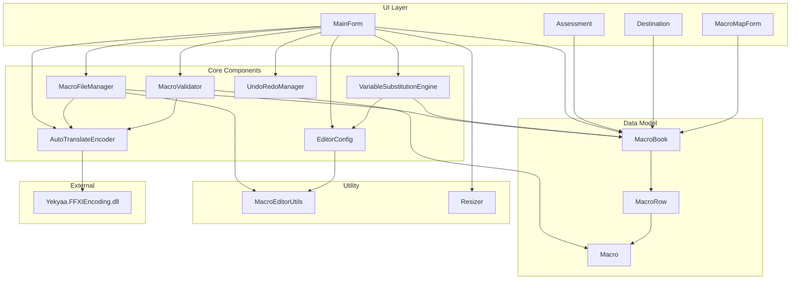

# Component Dependencies

## Dependency Diagram



## Dependency Matrix

| Component | Depends On |
|-----------|-----------|
| **Macro** | (none) |
| **MacroRow** | Macro |
| **MacroBook** | MacroRow |
| **MacroEditorUtils** | (none — pure static utility) |
| **Resizer** | (none — standalone utility) |
| **EditorConfig** | MacroEditorUtils (for string helpers if needed) |
| **AutoTranslateEncoder** | Yekyaa.FFXIEncoding.dll |
| **MacroFileManager** | MacroBook, MacroRow, Macro, AutoTranslateEncoder, MacroEditorUtils |
| **MacroValidator** | Macro, AutoTranslateEncoder |
| **VariableSubstitutionEngine** | MacroBook, EditorConfig |
| **UndoRedoManager** | (none — tracks changes generically) |
| **MainForm** | All core components + data model + Resizer |
| **Assessment** | MacroBook (read-only, for navigation) |
| **Destination** | MacroBook (read-only, for display) |
| **MacroMapForm** | MacroBook (read-only, for display) |

## Communication Patterns

### MainForm → Components (direct method calls)
MainForm creates and holds references to all core components. It calls methods directly — no events, no messaging, no service bus. Simple and appropriate for a desktop app.

### Components → Data Model (direct object manipulation)
Components receive data model objects as parameters or return them. The data model classes are plain C# objects with no framework dependencies.

### Assessment/Destination/MacroMap → Data Model (read-only access)
Sub-forms receive the `List<MacroBook>` reference from MainForm. They read from it for display but do not modify it directly. Navigation callbacks go through MainForm.

### AutoTranslateEncoder ↔ MacroFileManager (encoding during read/write)
MacroFileManager uses AutoTranslateEncoder to decode AT phrases when reading .dat files and encode them when writing. This is a direct dependency — FileManager holds a reference to the encoder.

## Data Flow

```
File System (.ttl/.dat)
    ↕ (read/write bytes)
MacroFileManager
    ↕ (parse/serialize using AutoTranslateEncoder)
List<MacroBook> (in-memory data model)
    ↕ (display substitution via VariableSubstitutionEngine)
MainForm UI (TextBoxes, Buttons, ListBox)
    ↕ (user edits tracked by UndoRedoManager)
List<MacroBook> (updated in-place)
    ↕ (save substitution via VariableSubstitutionEngine)
MacroFileManager
    ↕ (write bytes)
File System (.ttl/.dat) + EditorConfig → config.json
```

## Circular Dependency Prevention

The old architecture had circular references (Destination → MainForm → Destination). In the new design:

- Sub-forms (Assessment, Destination, MacroMapForm) receive the data model (`List<MacroBook>`) and a navigation callback (`Action<int,int,int>`) — they never reference MainForm directly
- Components never reference MainForm — they are called BY MainForm
- The data model is at the bottom of the dependency graph — nothing depends on it that it depends on
