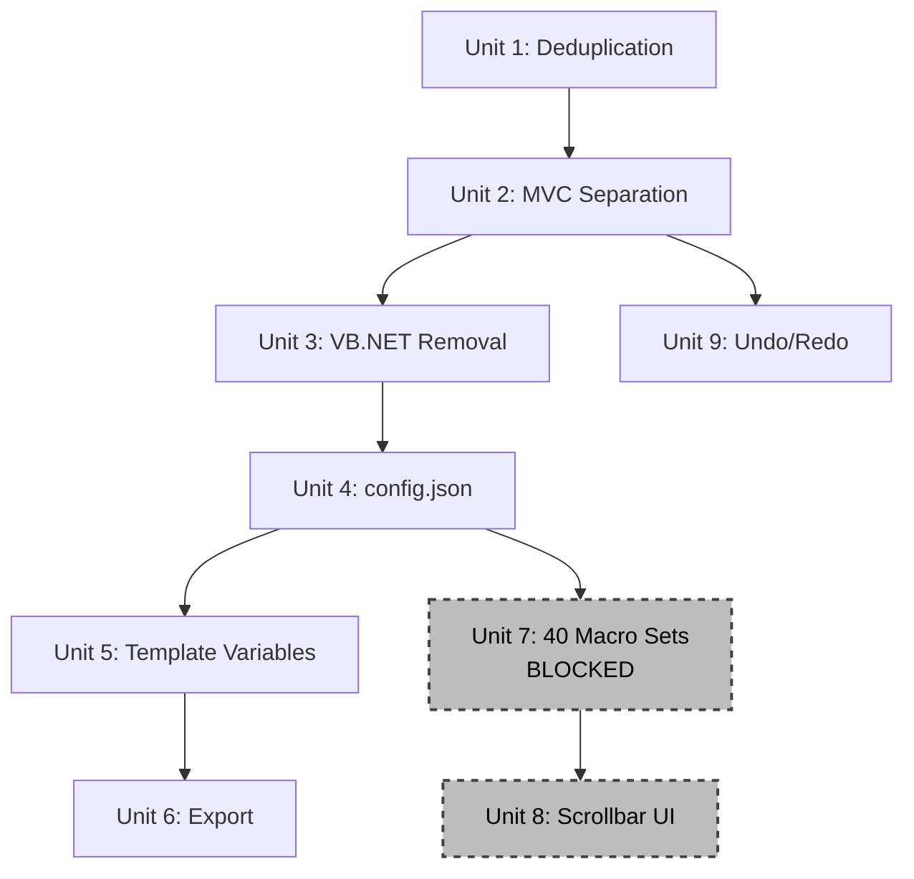

# Unit of Work Dependencies

## Dependency Diagram



## Dependency Matrix

| Unit | Depends On | Blocks |
|------|-----------|--------|
| Unit 1: Deduplication | Baseline (DONE) | Unit 2 |
| Unit 2: MVC Separation | Unit 1 | Unit 3, Unit 9 |
| Unit 3: VB.NET Removal | Unit 2 | Unit 4 |
| Unit 4: config.json | Unit 3 | Unit 5, Unit 7 |
| Unit 5: Template Variables | Unit 4 | Unit 6 |
| Unit 6: Export | Unit 5 | (none) |
| Unit 7: 40 Macro Sets | Unit 4 + sample files | Unit 8 |
| Unit 8: Scrollbar UI | Unit 7 | (none) |
| Unit 9: Undo/Redo | Unit 2 | (none) |

## Execution Order

**Critical Path** (must be sequential):
```
Baseline → Unit 1 → Unit 2 → Unit 3 → Unit 4 → Unit 5 → Unit 6
```

**Parallel Opportunities**:
- Unit 9 (Undo/Redo) can start after Unit 2, independent of Units 3-6
- Unit 7 (40 Macro Sets) can start after Unit 4, independent of Units 5-6

**Blocked**:
- Unit 7 requires sample files from user (not yet provided)
- Unit 8 requires Unit 7

## Shared Resources

| Resource | Used By | Notes |
|----------|---------|-------|
| Data Model (MacroBook/Row/Macro) | All units after Unit 2 | Established in Unit 2, used everywhere |
| MacroFileManager | Units 4, 5, 6, 7 | File I/O goes through this class |
| EditorConfig | Units 4, 5, 6, 7 | Config management |
| VariableSubstitutionEngine | Units 5, 6 | Substitution logic |
| MacroEditorUtils | Potentially all units | Shared utilities |
