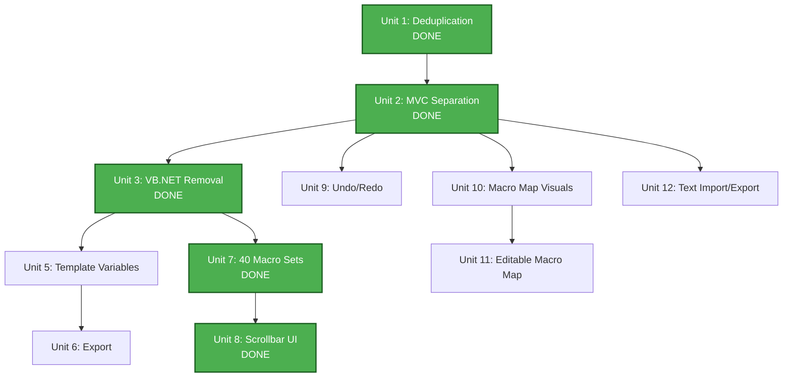

# Unit of Work Dependencies

## Dependency Diagram



## Dependency Matrix

| Unit                           | Depends On         | Blocks     | Status   |
|--------------------------------|--------------------|------------|----------|
| Unit 1: Deduplication          | Baseline           | Unit 2     | DONE     |
| Unit 2: MVC Separation         | Unit 1             | Unit 3, 9, 10, 12 | DONE     |
| Unit 3: VB.NET Removal         | Unit 2             | Unit 5, 7  | DONE     |
| ~~Unit 4: config.json~~        | ~~Unit 3~~         | —          | ELIMINATED |
| Unit 5: Template Variables     | Unit 3 + Unit 7    | Unit 6     | Pending  |
| Unit 6: Export                  | Unit 5             | (none)     | Pending  |
| Unit 7: 40 Macro Sets          | Unit 3             | Unit 8     | DONE     |
| Unit 8: Scrollbar UI           | Unit 7             | (none)     | DONE     |
| Unit 9: Undo/Redo              | Unit 2             | (none)     | Pending  |
| Unit 10: Macro Map Visuals     | Unit 2             | Unit 11    | Pending  |
| Unit 11: Editable Macro Map    | Unit 10            | (none)     | Pending  |
| Unit 12: Text Import/Export    | Unit 2             | (none)     | Pending  |
| Unit 13: Broadcast Edit        | Unit 2             | (none)     | Pending  |
| Unit 14: Warning Cleanup       | All other units    | (none)     | Pending  |

## Execution Order

**Critical Path** (must be sequential):
```text
Baseline → Unit 1 → Unit 2 → Unit 3 → Unit 5 → Unit 6
```

**Parallel Opportunities** (all unblocked now):
- Unit 5 (Template Variables) — next on critical path
- Unit 9 (Undo/Redo) — independent, unblocked since Unit 2
- Unit 10 (Macro Map Visuals) — independent, unblocked since Unit 2
- Unit 12 (Text Import/Export) — independent, unblocked since Unit 2

**Completed**:
- Units 1, 2, 3, 7, 8 all done and committed

## Shared Resources

| Resource                      | Used By          | Notes                                          |
|-------------------------------|------------------|------------------------------------------------|
| Data Model (MacroBook/Row/Macro) | All units after Unit 2 | Established in Unit 2, used everywhere     |
| MacroFileManager              | Units 5, 6, 12   | File I/O goes through this class               |
| Book 40 (Variable Store)      | Units 5, 6       | Variables defined in Book 40 macro slots       |
| VariableSubstitutionEngine    | Units 5, 6       | Reads Book 40, performs substitution           |
| MacroEditorUtils              | Potentially all   | Shared utilities                               |
