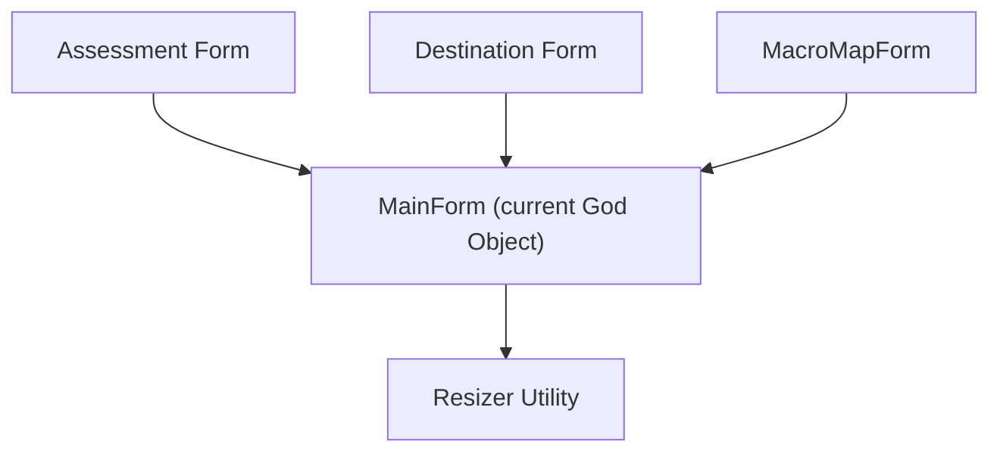
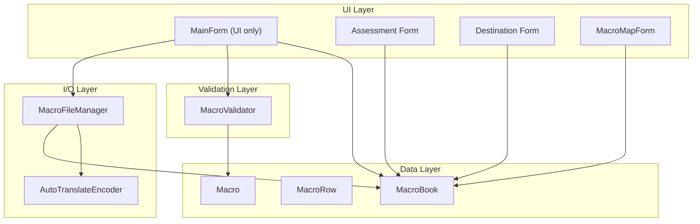
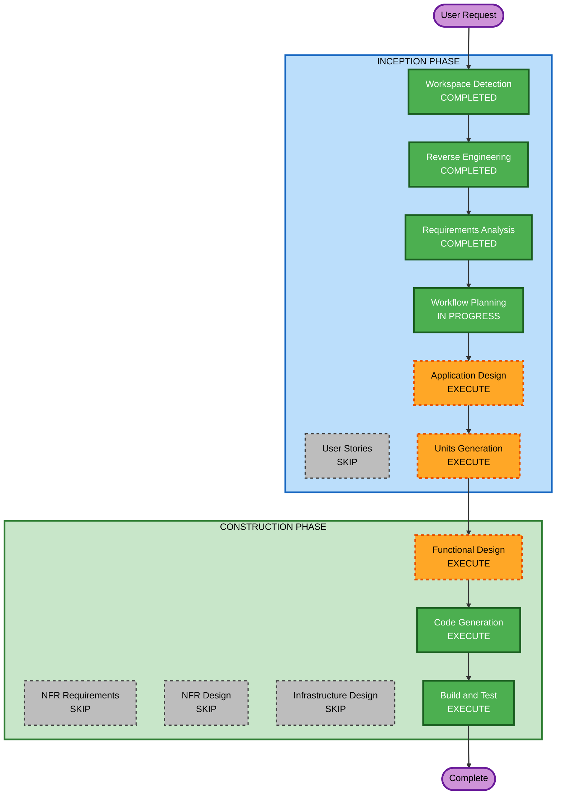

# Execution Plan

## Detailed Analysis Summary

### Transformation Scope
- **Transformation Type**: Architectural transformation (monolith → layered OOP)
- **Primary Changes**: Decompose God Object MainForm into data model, file I/O, validation, and UI layers
- **Related Components**: All forms (Assessment, Destination, MacroMapForm) depend on MainForm.MacroContainer — they will need to reference the new data model instead

### Change Impact Assessment
- **User-facing changes**: No — external behavior must remain identical
- **Structural changes**: Yes — complete architectural restructuring of internal code
- **Data model changes**: Yes — replacing fixed arrays with typed classes (MacroBook/MacroRow/Macro)
- **API changes**: No external APIs — internal interfaces will be redesigned
- **NFR impact**: No — desktop app, no network, no scalability concerns

### Component Relationships


After refactoring:


### Risk Assessment
- **Risk Level**: Medium — behavioral preservation across major restructuring
- **Rollback Complexity**: Easy — git revert to previous committed state per phase
- **Testing Complexity**: Moderate — requires manual testing of all macro operations per phase

## Workflow Visualization



### Text Alternative
```
INCEPTION PHASE:
- Workspace Detection (COMPLETED)
- Reverse Engineering (COMPLETED)
- Requirements Analysis (COMPLETED)
- User Stories (SKIP)
- Workflow Planning (IN PROGRESS)
- Application Design (EXECUTE)
- Units Generation (EXECUTE)

CONSTRUCTION PHASE:
- Functional Design (EXECUTE)
- NFR Requirements (SKIP)
- NFR Design (SKIP)
- Infrastructure Design (SKIP)
- Code Generation (EXECUTE)
- Build and Test (EXECUTE)
```

## Phases to Execute

### INCEPTION PHASE
- [x] Workspace Detection (COMPLETED)
- [x] Reverse Engineering (COMPLETED)
- [x] Requirements Analysis (COMPLETED)
- [x] User Stories - SKIP
  - **Rationale**: Pure internal refactoring with no new user-facing functionality or personas. The existing user workflow (open, edit, save macros) remains unchanged.
- [x] Workflow Planning (IN PROGRESS)
- [ ] Application Design - EXECUTE
  - **Rationale**: New components being created (MacroBook, MacroRow, Macro, MacroFileManager, AutoTranslateEncoder, MacroValidator). Need to define their interfaces, responsibilities, and relationships.
- [ ] Units Generation - EXECUTE
  - **Rationale**: Multiple distinct units of work with explicit testing gates between them (Baseline, Step 0a, 0b, 0c, Step 1). Need structured decomposition with dependency ordering.

### CONSTRUCTION PHASE
- [ ] Functional Design - EXECUTE
  - **Rationale**: Typed data model requires detailed design (class hierarchies, serialization logic, file format mapping). The MacroBook/MacroRow/Macro structure and its interaction with the binary file format needs careful specification.
- [ ] NFR Requirements - SKIP
  - **Rationale**: No performance, scalability, or security requirements beyond "no network calls." Desktop app with local file access only.
- [ ] NFR Design - SKIP
  - **Rationale**: Follows from NFR Requirements skip.
- [ ] Infrastructure Design - SKIP
  - **Rationale**: Standalone desktop application. No cloud, no containers, no deployment infrastructure.
- [ ] Code Generation - EXECUTE (ALWAYS)
  - **Rationale**: Implementation of all refactoring and feature code.
- [ ] Build and Test - EXECUTE (ALWAYS)
  - **Rationale**: Build verification and regression test documentation at each phase gate.

## Unit Execution Sequence

Units must execute in strict order due to dependencies:

| Order | Unit | Depends On | Gate |
|-------|------|-----------|------|
| 1 | Baseline Verification | None | Compiles + launches |
| 2 | Step 0a: Deduplication | Baseline | Manual test run |
| 3 | Step 0b: MVC Separation | Step 0a | Manual test run |
| 4 | Step 0c: VB.NET Removal | Step 0b | Manual test + regression docs |
| 5 | Step 1: config.json | Step 0c | Manual test run |
| 6 | Step 2: 40 Macro Sets | Step 1 + sample files | BLOCKED |
| 7 | Step 3: Scrollbar UI | Step 2 | Manual test run |
| 8 | Step 4: Template Variables | Step 1 | Manual test run |
| 9 | Step 5: Export with Substitution | Step 4 | Manual test run |

## Success Criteria
- **Primary Goal**: Transform monolithic decompiled code into maintainable OOP architecture, then add modern features
- **Key Deliverables**:
  - Clean, typed data model (MacroBook/MacroRow/Macro)
  - Separated concerns (File I/O, Validation, UI)
  - No VB.NET idioms remaining
  - config.json support
  - 40 macro set support (when unblocked)
  - Template variable system (load/save substitution with {placeholders})
  - Export with per-destination variable substitution
- **Quality Gates**:
  - Each phase compiles cleanly
  - Each phase preserves existing behavior
  - FFXI client can still read files produced by the editor
  - No network calls in final application
