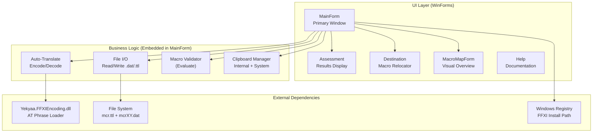
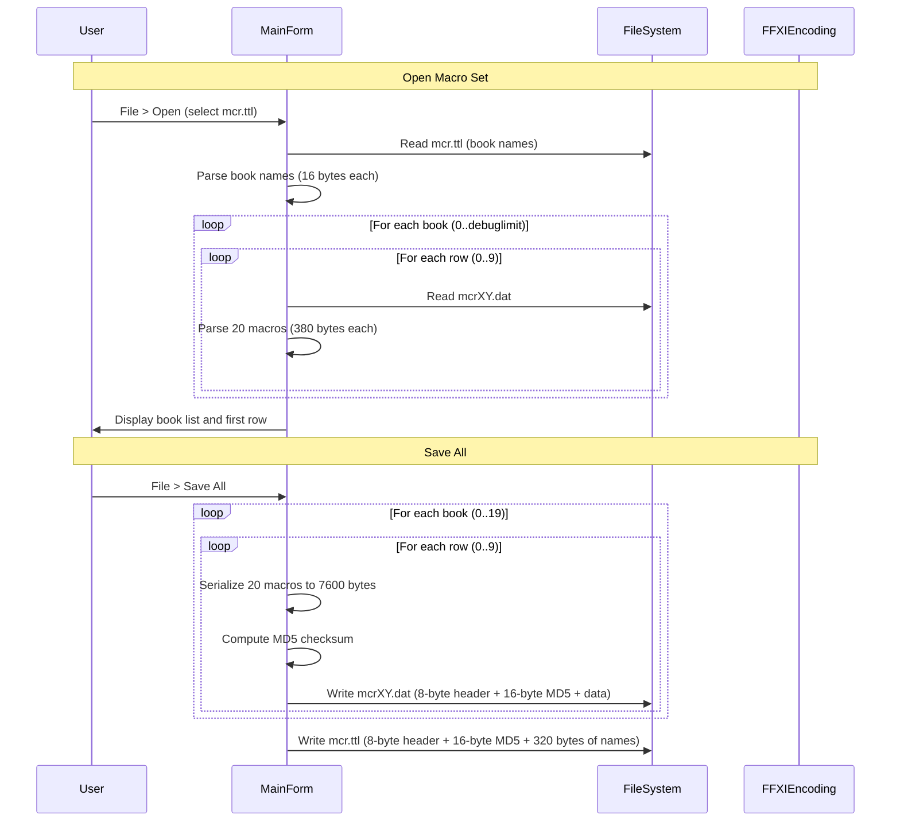

# System Architecture

## System Overview

The FFXI Macro Editor is a single-process Windows Forms desktop application built on .NET Framework 4.5.2. It follows a monolithic architecture with no network dependencies or external services. All data is stored in local binary files that conform to the FFXI game client's macro file format.

## Architecture Diagram

## Component Descriptions

### MainForm
- **Purpose**: Central application controller and primary UI
- **Responsibilities**: All macro editing, file I/O, parsing, serialization, validation, clipboard, and navigation
- **Dependencies**: Yekyaa.FFXIEncoding, System.Windows.Forms, System.Security.Cryptography
- **Type**: Application (UI + Business Logic, tightly coupled)

### Assessment
- **Purpose**: Display macro evaluation results and search results
- **Responsibilities**: Show lists of validation issues and search matches with navigation
- **Dependencies**: MainForm (for navigation callbacks)
- **Type**: Application (UI)

### Destination
- **Purpose**: Macro redirection dialog
- **Responsibilities**: Allow user to select target book/row/macro for macro relocation
- **Dependencies**: MainForm (accesses MacroContainer directly)
- **Type**: Application (UI)

### MacroMapForm
- **Purpose**: Visual macro overview
- **Responsibilities**: Display full book contents as a scrollable grid of labels
- **Dependencies**: MainForm (accesses MacroContainer for display)
- **Type**: Application (UI)

### Resizer
- **Purpose**: Dynamic proportional resizing utility
- **Responsibilities**: Track and recalculate control positions/sizes on window resize
- **Dependencies**: None (standalone utility)
- **Type**: Utility

### Yekyaa.FFXIEncoding.dll
- **Purpose**: External library for loading FFXI auto-translate phrase data
- **Responsibilities**: Parse game data files and provide AT phrase lookup
- **Dependencies**: FFXI game data files
- **Type**: External Library

## Data Flow

## Integration Points

- **External APIs**: None (offline desktop application)
- **Databases**: None
- **Third-party Services**: None
- **File System**: FFXI macro directory (USER folder under FFXI installation)
- **Windows Registry**: PlayOnline registry keys for auto-detecting FFXI installation path
