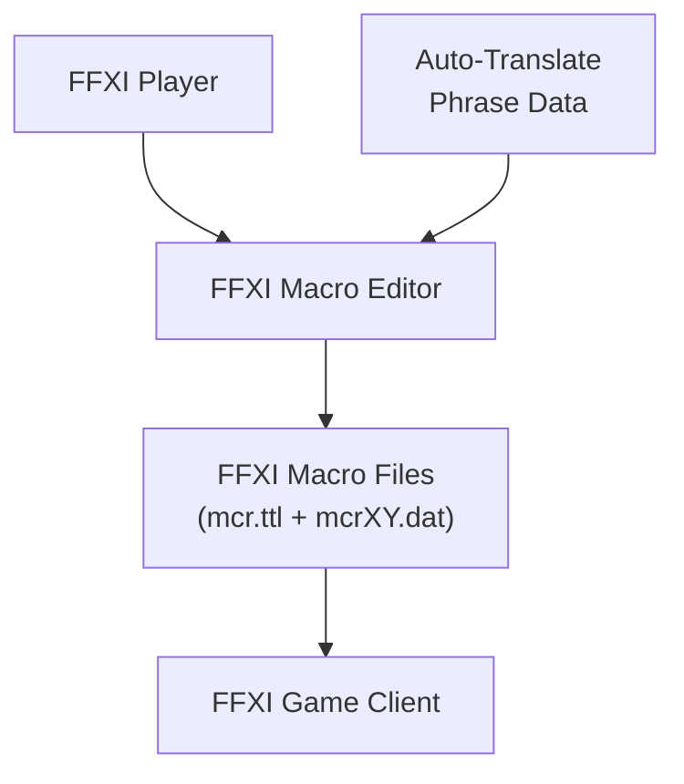

# Business Overview

## Business Context Diagram

## Business Description

- **Business Description**: The FFXI Macro Editor is a standalone Windows desktop application that allows Final Fantasy XI players to create, edit, import/export, and manage their in-game macros outside of the FFXI game client. It reads and writes the binary macro data files used by FFXI, providing a more efficient editing experience than the in-game macro editor.
- **Business Transactions**:
  - **Open Macro Set**: Load all macro books from a user's FFXI macro directory by reading the mcr.ttl title file and all associated mcrXY.dat data files
  - **Edit Macro**: Modify macro titles and command lines (6 lines per macro, 8-char title)
  - **Save Macro Row**: Write a single row of macros back to its .dat file with MD5 checksum
  - **Save All Macros**: Write all macro books to their respective .dat files and update mcr.ttl
  - **Copy/Paste Macros**: Internal and clipboard-based copy/paste of individual macros, rows, sides, and entire books
  - **Import Macros**: Import macro data from external files
  - **Evaluate Macros**: Validate all macros for line length, invalid characters, and format errors
  - **Search Macros**: Find macros across all books by content
  - **Macro Map**: Visual overview of all macros in a book showing their titles and content
  - **Auto-Translate Integration**: Insert and display FFXI auto-translate phrases within macro lines
- **Business Dictionary**:
  - **Book**: A named collection of 10 rows of macros (currently 20 books supported, game now supports 40)
  - **Row**: A numbered set (1-10) within a book containing 20 macros (10 Ctrl + 10 Alt)
  - **Macro**: A single macro consisting of a title (max 8 chars) and 6 command lines (max 60 encoded chars each)
  - **Ctrl Macros**: The first 10 macros in a row (Ctrl+1 through Ctrl+0)
  - **Alt Macros**: The second 10 macros in a row (Alt+1 through Alt+0)
  - **mcr.ttl**: The title file containing all book names (16 bytes per name, with 8-byte header + 16-byte MD5)
  - **mcrXY.dat**: Individual macro data file for book X, row Y (8-byte header + 16-byte MD5 + 7600 bytes of macro data)
  - **Auto-Translate (AT) Phrase**: A special FFXI in-game phrase that translates between languages, encoded as hex codes wrapped in 0xFD markers

## Component Level Business Descriptions

### MainForm
- **Purpose**: Primary application window providing the full macro editing interface
- **Responsibilities**: File I/O, macro parsing/serialization, UI management, clipboard operations, auto-translate integration, macro evaluation, search

### Assessment
- **Purpose**: Results display form for macro evaluation and search operations
- **Responsibilities**: Display validation warnings/errors and search results with clickable navigation

### Destination
- **Purpose**: Macro relocation dialog allowing users to point macros to different book/row/macro positions
- **Responsibilities**: Provide book/row/macro selection for macro redirection

### MacroMapForm
- **Purpose**: Visual macro map showing all macros in a book as a grid overview
- **Responsibilities**: Generate and display clickable labels for all macros in a book, enabling quick navigation

### Resizer
- **Purpose**: Dynamic form resizing utility that proportionally scales all controls when the window is resized
- **Responsibilities**: Track original control positions/sizes and recalculate on resize events

### Help
- **Purpose**: Help/documentation display form
- **Responsibilities**: Show usage instructions and feature documentation
