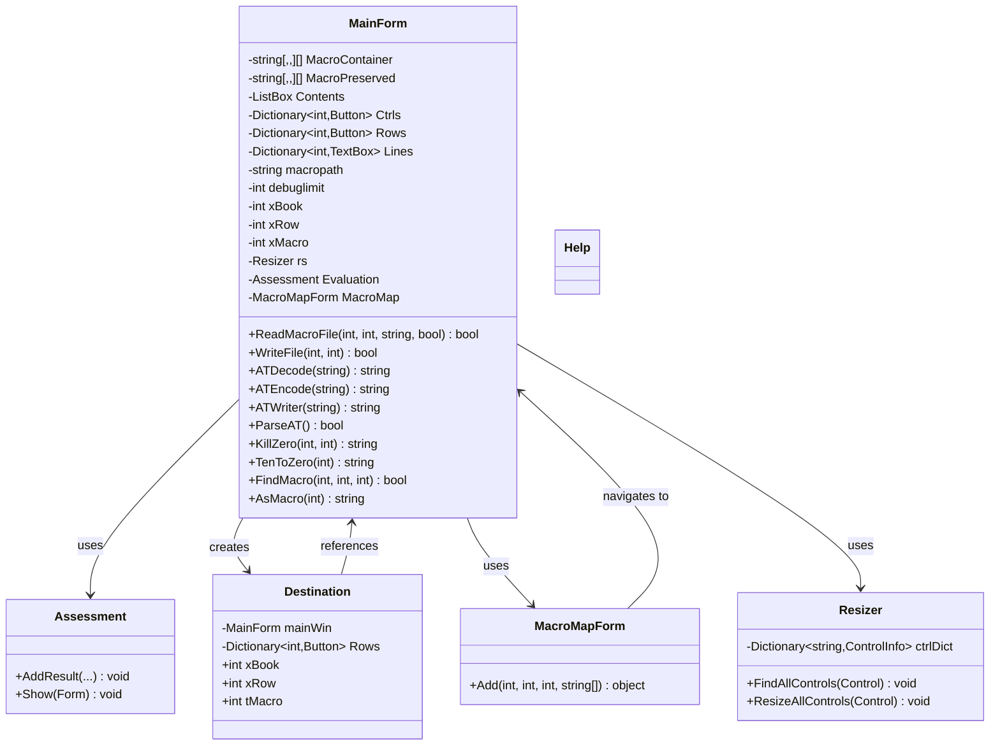

# Code Structure

## Build System
- **Type**: MSBuild (Visual Studio .csproj)
- **Configuration**: `Macro Editor.csproj` targeting .NET Framework 4.5.2
- **Solution**: `Macro Editor.sln`
- **Output**: WinExe (Windows Forms Executable)
- **Platform**: AnyCPU

## Key Classes/Modules

### Existing Files Inventory

- `MainForm.cs` - Primary application logic: file I/O, macro parsing/serialization, UI event handling, clipboard operations, auto-translate encoding/decoding, macro validation, search
- `MainForm.Designer.cs` - WinForms designer-generated UI component initialization (menus, dialogs, status bar)
- `Assessment.cs` - Assessment/results form for displaying evaluation warnings and search results
- `Assessment.Designer.cs` - Designer-generated code for Assessment form
- `Destination.cs` - Macro destination selection dialog for relocating macros between books/rows
- `Destination.Designer.cs` - Designer-generated code for Destination form
- `Help.cs` - Help dialog form
- `Help.Designer.cs` - Designer-generated code for Help form
- `MacroMapForm.cs` - Visual macro map showing all macros in a book as clickable labels
- `MacroMapForm.Designer.cs` - Designer-generated code for MacroMapForm
- `Resizer.cs` - Utility class for proportional control resizing on window resize
- `My/MyApplication.cs` - VB.NET-style application framework entry point
- `My/MyComputer.cs` - VB.NET-style computer information wrapper
- `My/MyProject.cs` - VB.NET-style project singleton references
- `My/MySettings.Designer.cs` - Auto-generated user settings (UserDirectory)
- `My/MySettingsProperty.cs` - Settings property accessor
- `My/Resources/Resources.cs` - Resource management
- `Properties/AssemblyInfo.cs` - Assembly metadata

## Design Patterns

### God Object (Anti-pattern)
- **Location**: MainForm.cs
- **Purpose**: All business logic, file I/O, and UI handling in a single class
- **Implementation**: ~4600 lines combining parsing, serialization, validation, clipboard, AT encoding, and all UI event handlers

### VB.NET Application Framework
- **Location**: My/ directory
- **Purpose**: Uses VB.NET-style application framework with MyProject singleton for form management
- **Implementation**: MyProject.Forms provides singleton access to form instances

### In-Memory Data Store
- **Location**: MainForm.MacroContainer / MainForm.MacroPreserved
- **Purpose**: Holds all macro data in a 3D jagged array with backup for revert functionality
- **Implementation**: `string[20, 10, 20][]` — [book, row, macro][title + 6 lines]

## Critical Dependencies

### Yekyaa.FFXIEncoding.dll
- **Version**: Unknown (no version metadata visible)
- **Usage**: Loaded at startup via `FFXIATPhraseLoader` to populate auto-translate phrase dictionary
- **Purpose**: Provides FFXI auto-translate phrase lookup data for encoding/decoding AT markers in macro text

### .NET Framework 4.5.2
- **Version**: 4.5.2
- **Usage**: Runtime framework
- **Purpose**: WinForms, crypto (MD5), regex, file I/O, registry access

### Microsoft.VisualBasic
- **Version**: Framework-bundled
- **Usage**: String operations (Strings.Split, Strings.Join), Interaction (MsgBox, InputBox), Conversions, Operators
- **Purpose**: Legacy VB.NET compatibility — the application was likely originally written in VB.NET and decompiled/converted to C#
