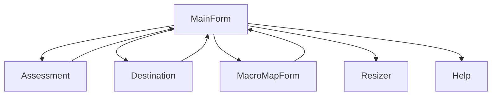

# Dependencies

## Internal Dependencies

### MainForm depends on Assessment
- **Type**: Runtime
- **Reason**: Creates Assessment instances for displaying evaluation results and search results

### MainForm depends on Destination
- **Type**: Runtime
- **Reason**: Creates Destination dialog for macro relocation feature

### MainForm depends on MacroMapForm
- **Type**: Runtime
- **Reason**: Creates MacroMapForm for visual macro overview display

### MainForm depends on Resizer
- **Type**: Runtime
- **Reason**: Uses Resizer to proportionally scale all controls on window resize

### Destination depends on MainForm
- **Type**: Runtime (bidirectional)
- **Reason**: Accesses MainForm.Contents and MainForm.MacroContainer to display book/row/macro data

### MacroMapForm depends on MainForm
- **Type**: Runtime (bidirectional)
- **Reason**: Calls MainForm.FindMacro() to navigate when user clicks a macro label

### Assessment depends on MainForm
- **Type**: Runtime (bidirectional)
- **Reason**: Navigates to specific macros via MainForm.FindMacro() when user clicks results

## External Dependencies

### Yekyaa.FFXIEncoding.dll
- **Version**: Unknown
- **Purpose**: Load FFXI auto-translate phrase data for encoding/decoding AT phrases in macros
- **License**: Unknown (community-created FFXI utility library)
- **Key Classes Used**: FFXIATPhraseLoader, FFXIATPhrase

### .NET Framework 4.5.2
- **Version**: 4.5.2
- **Purpose**: Runtime framework providing WinForms, crypto, regex, file I/O, registry
- **License**: Microsoft .NET Framework License

### Microsoft.VisualBasic
- **Version**: Framework-bundled
- **Purpose**: Legacy VB.NET compatibility (Strings, Interaction, Conversions, Operators)
- **License**: Included with .NET Framework
